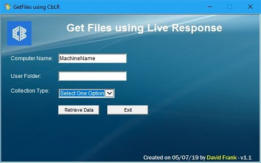

# CBLR_GetFiles

**Description**: This script uses CbLR to copy files for forensic analysis from a machine using Carbon Black Response / VMware Carbon Black EDR.  The HTA will call Python script which will connect to the remote machine using CbLR and then upload a Powershell script and RawCopy64.exe (if needed) and runs it.  The script will copy file(s) based upon the selection on the HTA and then compress and download the data to your machine in the Output folder.  

**Usage**:

Double click on GetFiles.hta which will open a GUI that will prompt for ComputerName, UserName and collection type.  Click the "Retrieve Data" button to call the python script with the parameters shown below.

`Python GetFiles_CbLR.py -h ComputerName -c CollectionType -u UserName`

**Output**:

\<ScriptDir>\Output\ComputerName_ExportedFiles.Zip

**CollectionTypes**: 
- AutoRuns - Autoruns64.exe  (Put in same folder as this script)
- BrowserFiles - WebCacheV01.dat, History, Preferences
- EventLogs - Application, Security, System
- PreferencesFile - Google Preferences file
- Registry - NTUSER.DAT, SYSTEM, SOFTWARE
- SecurityEventLog - Security

---

