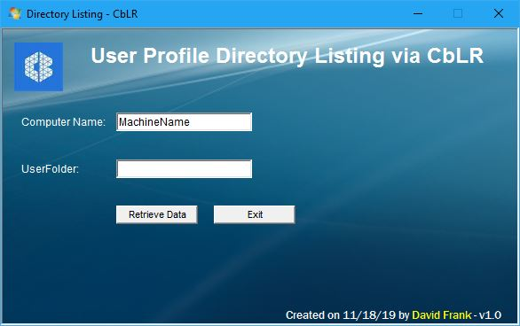

# CbLR_DirListing

**Description**: This script uses CbLR to create a directory listing of a users profile and MD5 hash the files.  The HTA will call Python script which will connect to the remote machine using CbLR and then upload a Powershell script and run it.  

**Usage**:

Double click on DirListing.hta which will open a GUI that will prompt for ComputerName and UserName.  Click the "Retrieve Data" button to call the python script with the parameters shown below.

`Python DirListing.py ComputerName UserName`

**Output**:

\<ScriptDir>\Output\ComputerName_DirectoryListing.csv

**Fields**: 
Creation Time, LastWriteTime, LastAccessTime, Length, Name, FullName, Extension, Attributes, MD5, and File_Location

---

