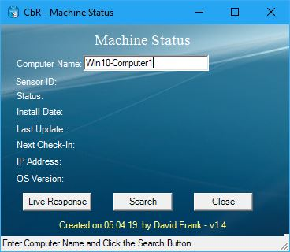
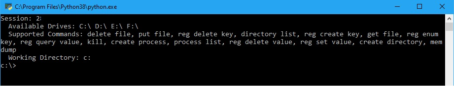

# Machine Status

**Description**: This PowerShell script will query a machine in Carbon Black Response / VMware Carbon Black EDR to see if it's online or offline.  If the machine is online, it will show the agent install date, last update time, next checkin time and OS version.  

**Usage**:

```powershell
powershell.exe -Exec Bypass -NoLogo -WindowStyle Hidden -File MachineStatus_CbR.ps1
```

After clicking the Search button and if the computer is online, you can click the "Live Response" button wihch will call the python script "cblr_cli.py" that will open a limited Live Response session to this machine.  

**Note**: If you click in the Computer Name text box, it will clear the information in the other fields.  

**Sample Screen Output**:







